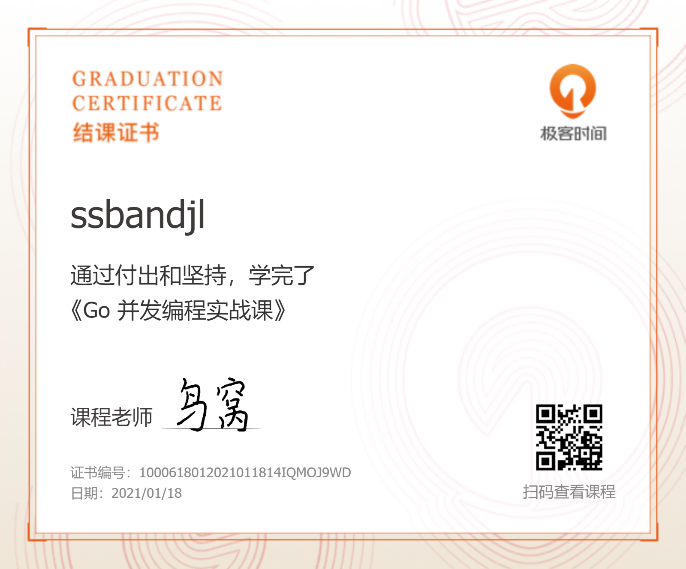

# 简介

# 分类导航

- [channel](./channel/README.md)

- 编码

  - 字符编码

    +  [记一次websocket开发中对字符编码的理解](https://zhuanlan.zhihu.com/p/67522753)

- 测试
  
  + [官方文档](https://golang.org/pkg/testing/)
    * [测试参数Testing flags](https://golang.org/cmd/go/#hdr-Testing_flags)
  
- [并发编程实战课](./concurrent)
- 

  - [Channel](./concurrent/channel)

    - [13 | Channel：另辟蹊径，解决并发问题](./concurrent/channel/basic.md)

      + 核心
        + channel发展/CSP通信顺序进程/channel的5种应用场景/基本用法/实现原理/使用 Channel 容易犯的错误/goroutine 泄漏/总结

    - [14 | Channel：透过代码看典型的应用模式](./concurrent/channel/example.md)

      + 核心

        + 使用反射操作Channel/动态处理 n 个 chan/

        - 典型的应用场景:消息交流/数据传递/token实现任务编排/任务编排/信号通知/实现互斥锁/happens-before关系/
        - 多个 chan 的编排方式
          + Or-Done 模式/扇入模式/扇出模式/Stream/map-reduce

    - [15 | 内存模型：Go如何保证并发读写的顺序？](./concurrent/channel/example.md)

      - 核心
        - 内存模型(并发环境中共享变量可见性)/指令重排和可见性的问题/happens-before/Go 语言中保证的 happens-before 关系

  - 扩展并发原语

    - [16 | Semaphore：一篇文章搞懂信号量](./concurrent/channel/semaphore/README.md)
      - 核心
        - 并发编程进阶/信号量介绍/信号量P/V操作/P 操作（decrease、wait、acquire）是减少信号量的计数值，而 V 操作（increase、signal、release）是增加信号量的计数值/信号量与互斥锁区别和联系/Go 官方扩展库的实现/Weighted设置权重/应用场景/信号量实现原理/常见错误/其它信号量的实现/利用channel实现一个简单的信号量/`marusama/semaphore`

- **目录**

  | chapter02 |golang基本入门/转义字符            |
  | --------- | ---------- |
  | chapter03 |变量/快速入门/类型推导/申明多个变量/变量三要素/加号运算和拼接/变量数据类型/查看变量数据类型/格式化输出/浮点型/科学计数法/数据类型转换/指针/标识符的命名规范         |
  | chapter04 |运算符/键盘输入语句/位运算            |
  | chapter05 |程序流程控制/单分支/多分支/for/switch/打印空心三角形/九九乘法表/break/随机值rand.Seed/continue/goto     |
  | chapter06 |函数/包/递归函数/init/匿名函数/闭包/defer/函数参数传递/作用域/金字塔/九九乘法表指定数/字符串系统函数/内建函数/时间和日期相关函数/时间常量/错误处理/自定义错误     |
  | chapter07 |数组array和切片slice/切片扩容/删除字节切片中的空格/切片过滤|
  | chapter08 |排序和查找/冒泡排序(比较和交换)/二分递归查找/二维数组|
  | chapter09 |map映射/map嵌套/增删改查/遍历(for-range)/map切片/map切片append动态增长/map排序        |
  | chapter10 |面向对象上/结构体/方法/方法VS函数/面向对象编程实例/结构体赋值/工厂模式         |
  | chapter11 |抽象/银行账户/封装Set Get/继承匿名结构体/避免多重继承/接口interface/手机相机电脑USB接口案例/Hero结构体排序示例/接口VS继承(接口是继承的一种补充)/多态/多态参数和多态数组/类型断言(接口转换为某个类型)/类型断言最佳实践(判断变量类型)  |
  | chapter12 | 家庭收支记账项目account/面向对象 |
  | chapter13 | 客户信息关系系统customerManage/删除切片对应的index的元素append(this.customers[:index], this.customers[index+1:]...) |
  | chapter14 | 文件操作/os.File结构体/ioutil.ReadFile/ioutil.WriteFile/读文件/带缓冲写文件/命令行参数/os.Args/flag/序列化为json/json.Marshal/tag标签/json反序列化为其他KV类型/json.Unmarshal([]byte(str),&xxx) |
  | chapter15 | 单元测试/t.Fatalf/t.Logf |
  | chapter16 | goroutine/判断大数是否是素数/进程和线程(相比协程还是偏重)/并发(多线程单核,微观是时间分片,与Web并发概念有区别)和并行(多线程多核)/协程(轻量级线程,独立栈,共享堆,用户调度,轻松开启上万个协程)和主线程(重量级物理线程，直接作用在CPU,其他语言并发是基于线程的，线程过多(几千个)耗费资源)/channel/MPG模式(M:主线程,P:协程上下文,G:协程,协程可形成队列)/MPG运行状态/设置CPU核数/协程间通信,资源竞争等/go build -race查看资源竞争关系/互斥锁sync.Mutex/Lock/Unlock/ |
  | chapter17 |反射reflect/TypeOf/ValueOf/常量/iota赋零值/修改值rVal.Elem().SetInt(20)/获取标签tagVal := typ.Field(i).Tag.Get("json")/bridge适配器(通过反射自适应参数个数)|
  | chapter18 |TCP编程/Redis/init()初始化连接池      |
  | chapter20 | 数据结构/栈/稀疏数组sparseArray/队列/数组实现非环形队列singleQueue/常见排序/二分查找/二叉树/快速排序/插入排序/链表       |
  

分布式队列和分布式优先队列: /Users/xb/gitlab/go/go_core_program/concurrent/distributed-main
延迟进行初始化once, 单例模式, 线程安全的map, 分片索引, 把锁的粒度限制在分片上, sync.map, store, load, delete, 
SingleFlight(单程,合并请求,防止缓存击穿) 和 CyclicBarrier：请求合并和循环栅栏, SingleFlight 的作用是将并发请求合并成一个请求，以减少对下层服务的压力, 而 CyclicBarrier 是一个可重用的栅栏并发原语，用来控制一组请求同时执行的数据结构

- 目录2

  | 视频文件                                                     | 代码位置        | 说明 |
  | ------------------------------------------------------------ | --------------- | ---- |
  | 001_尚硅谷_Go核心编程_Golang可以做什么.avi                   |                 |      |
  | 002_尚硅谷_Go核心编程_如何学习Golang更高效(1).wmv            |                 |      |
  | 003_尚硅谷_Go核心编程_如何学习Golang更高效(2).wmv            |                 |      |
  | 004_尚硅谷_Go核心编程_程序的基本概念.avi                     |                 |      |
  | 005_尚硅谷_Go核心编程_Go语言发展简史.avi                     |                 |      |
  | 006_尚硅谷_Go核心编程_Go语言的特性和快速体验.avi             |                 |      |
  | 007_尚硅谷_Go核心编程_Golang开发工具介绍.avi                 |                 |      |
  | 008_尚硅谷_Go核心编程_windows下VSCode的安装和使用(1).avi     |                 |      |
  | 009_尚硅谷_Go核心编程_windows下VSCode的安装和使用(2).avi     |                 |      |
  | 010_尚硅谷_Go核心编程_Linux下VSCode的安装和使用.avi          |                 |      |
  | 011_尚硅谷_Go核心编程_Mac下VSCode的安装和使用.avi            |                 |      |
  | 012_尚硅谷_Go核心编程_Windows下搭建Go开发环境.avi            |                 |      |
  | 013_尚硅谷_Go核心编程_Linux下搭建Go开发环境.avi              |                 |      |
  | 014_尚硅谷_Go核心编程_Mac下搭建Go开发环境.avi                |                 |      |
  | 015_尚硅谷_Go核心编程_Go程序开发和基本结构说明.avi           |                 |      |
  | 016_尚硅谷_Go核心编程_Linux和Mac下开发Go程序.avi             |                 |      |
  | 017_尚硅谷_Go核心编程_Golang执行流行分析.avi                 |                 |      |
  | 018_尚硅谷_Go核心编程_Golang编译运行说明.avi                 |                 |      |
  | 019_尚硅谷_Go核心编程_Go语法要求和注意事项.avi               |                 |      |
  | 020_尚硅谷_Go核心编程_Go的转义字符.avi                       |                 |      |
  | 021_尚硅谷_Go核心编程_Go开发常见错误和解决方法.avi           |                 |      |
  | 022_尚硅谷_Go核心编程_Go语言的注释.avi                       |                 |      |
  | 023_尚硅谷_Go核心编程_规范的代码风格要求.avi                 |                 |      |
  | 024_尚硅谷_Go核心编程_Go官方编程指南.avi                     |                 |      |
  | 025_尚硅谷_Go核心编程_Go语言标准库API.avi                    |                 |      |
  | 026_尚硅谷_Go核心编程_Dos常用指令介绍.avi                    |                 |      |
  | 027_尚硅谷_Go核心编程_目录操作.avi                           |                 |      |
  | 028_尚硅谷_Go核心编程_文件操作.avi                           |                 |      |
  | 029_尚硅谷_Go核心编程_其它指令和综合练习.avi                 |                 |      |
  | 030_尚硅谷_Go核心编程_练习题评讲和总结.avi                   |                 |      |
  | 031_尚硅谷_Go核心编程_为什么需要变量.avi                     |                 |      |
  | 032_尚硅谷_Go核心编程_变量介绍和快速入门.avi                 |                 |      |
  | 033_尚硅谷_Go核心编程_变量使用细节(1).avi                    |                 |      |
  | 034_尚硅谷_Go核心编程_变量使用细节(2).avi                    |                 |      |
  | 035_尚硅谷_Go核心编程_明确变量几个概念.avi                   |                 |      |
  | 036_尚硅谷_Go核心编程_数据类型介绍.avi                       |                 |      |
  | 037_尚硅谷_Go核心编程_整数类型基本使用.avi                   |                 |      |
  | 038_尚硅谷_Go核心编程_整数类型使用细节.avi                   |                 |      |
  | 039_尚硅谷_Go核心编程_浮点类型基本使用.avi                   |                 |      |
  | 040_尚硅谷_Go核心编程_浮点类型使用细节.avi                   |                 |      |
  | 041_尚硅谷_Go核心编程_字符类型基本使用.avi                   |                 |      |
  | 042_尚硅谷_Go核心编程_字符类型注意事项.avi                   |                 |      |
  | 043_尚硅谷_Go核心编程_布尔类型的使用.avi                     |                 |      |
  | 044_尚硅谷_Go核心编程_字符串类型基本使用.avi                 |                 |      |
  | 045_尚硅谷_Go核心编程_字符串类型细节说明.avi                 |                 |      |
  | 046_尚硅谷_Go核心编程_基本数据类型默认值.avi                 |                 |      |
  | 047_尚硅谷_Go核心编程_基本数据相互转换.avi                   |                 |      |
  | 048_尚硅谷_Go核心编程_基本数据转换细节讨论.avi               |                 |      |
  | 049_尚硅谷_Go核心编程_基本数据转string.avi                   |                 |      |
  | 050_尚硅谷_Go核心编程_string转基本数据类型.avi               |                 |      |
  | 051_尚硅谷_Go核心编程_string转基本类型细节.avi               |                 |      |
  | 052_尚硅谷_Go核心编程_指针及其内存布局.avi                   |                 |      |
  | 053_尚硅谷_Go核心编程_指针案例和使用陷阱.avi                 |                 |      |
  | 054_尚硅谷_Go核心编程_值类型和引用类型.avi                   |                 |      |
  | 055_尚硅谷_Go核心编程_标识符基本使用.avi                     |                 |      |
  | 056_尚硅谷_Go核心编程_Go标识符命名特点和规范.avi             |                 |      |
  | 057_尚硅谷_Go核心编程_保留关键字和预定义标识符.avi           |                 |      |
  | 058_尚硅谷_Go核心编程_运算符基本介绍.avi                     |                 |      |
  | 059_尚硅谷_Go核心编程_算术运算符基本使用.avi                 |                 |      |
  | 060_尚硅谷_Go核心编程_算术运算符细节讨论.avi                 |                 |      |
  | 061_尚硅谷_Go核心编程_算术运算符课堂练习.avi                 |                 |      |
  | 062_尚硅谷_Go核心编程_关系运算符.avi                         |                 |      |
  | 063_尚硅谷_Go核心编程_逻辑运算符基本使用.avi                 |                 |      |
  | 064_尚硅谷_Go核心编程_短路与和短路或.avi                     |                 |      |
  | 065_尚硅谷_Go核心编程_赋值运算符基本使用.avi                 |                 |      |
  | 066_尚硅谷_Go核心编程_赋值运算经典面试题.avi                 |                 |      |
  | 066_尚硅谷_Go核心编程_运算符优先级.avi                       |                 |      |
  | 067_尚硅谷_Go核心编程_其它运算符.avi                         |                 |      |
  | 068_尚硅谷_Go核心编程_获取用户终端输入.avi                   |                 |      |
  | 069_尚硅谷_Go核心编程_计算机进制的介绍.avi                   |                 |      |
  | 070_尚硅谷_Go核心编程_其它进制转十进制.avi                   |                 |      |
  | 071_尚硅谷_Go核心编程_十进制转其它进制.avi                   |                 |      |
  | 072_尚硅谷_Go核心编程_二进制转其它进制.avi                   |                 |      |
  | 073_尚硅谷_Go核心编程_其它进制转二进制.avi                   |                 |      |
  | 074_尚硅谷_Go核心编程_原码  反码 补码.avi                    |                 |      |
  | 075_尚硅谷_Go核心编程_位运算深度讲解.avi                     |                 |      |
  | 076_尚硅谷_Go核心编程_流程控制介绍.avi                       |                 |      |
  | 077_尚硅谷_Go核心编程_单分支基本使用.avi                     |                 |      |
  | 078_尚硅谷_Go核心编程_单分支流程图和细节.avi                 |                 |      |
  | 079_尚硅谷_Go核心编程_双分支基本使用.avi                     |                 |      |
  | 080_尚硅谷_Go核心编程_双分支流程图和细节.avi                 |                 |      |
  | 081_尚硅谷_Go核心编程_单分支双分支课堂练习(1).avi            |                 |      |
  | 082_尚硅谷_Go核心编程_单分支双分支课堂练习(2).avi            |                 |      |
  | 083_尚硅谷_Go核心编程_多分支基本使用.avi                     |                 |      |
  | 084_尚硅谷_Go核心编程_多分支应用案例.avi                     |                 |      |
  | 085_尚硅谷_Go核心编程_嵌套分支.avi                           |                 |      |
  | 086_尚硅谷_Go核心编程_switch基本使用.avi                     |                 |      |
  | 087_尚硅谷_Go核心编程_switch使用细节(1).avi                  |                 |      |
  | 088_尚硅谷_Go核心编程_switch使用细节(2).avi                  |                 |      |
  | 089_尚硅谷_Go核心编程_switch的课堂练习.avi                   |                 |      |
  | 090_尚硅谷_Go核心编程_循环控制基本介绍和入门.avi             |                 |      |
  | 091_尚硅谷_Go核心编程_for循环语法和执行流程.avi              |                 |      |
  | 092_尚硅谷_Go核心编程_for循环注意事项和细节(1).avi           |                 |      |
  | 093_尚硅谷_Go核心编程_for循环注意事项和细节(2).avi           |                 |      |
  | 094_尚硅谷_Go核心编程_for循环课堂练习.avi                    |                 |      |
  | 095_尚硅谷_Go核心编程_实现while和dowhile控制.avi             |                 |      |
  | 096_尚硅谷_Go核心编程_多重循环应用案例.avi                   |                 |      |
  | 097_尚硅谷_Go核心编程_经典案例打印空心金字塔.avi             |                 |      |
  | 098_尚硅谷_Go核心编程_经典案例九九乘法表.avi                 |                 |      |
  | 099_尚硅谷_Go核心编程_流程控制课后练习说明.avi               |                 |      |
  | 100_尚硅谷_Go核心编程_break引入和快速入门.avi                |                 |      |
  | 101_尚硅谷_Go核心编程_break语法和流程图.avi                  |                 |      |
  | 102_尚硅谷_Go核心编程_break注意事项和细节说明.avi            |                 |      |
  | 103_尚硅谷_Go核心编程_break课堂练习.avi                      |                 |      |
  | 104_尚硅谷_Go核心编程_continue介绍和流程图.avi               |                 |      |
  | 105_尚硅谷_Go核心编程_continue执行流程分析.avi               |                 |      |
  | 106_尚硅谷_Go核心编程_continue课堂练习.avi                   |                 |      |
  | 107_尚硅谷_Go核心编程_goto和return.avi                       |                 |      |
  | 108_尚硅谷_Go核心编程_为什么需要函数.avi                     |                 |      |
  | 109_尚硅谷_Go核心编程_函数介绍和应用案例.avi                 |                 |      |
  | 110_尚硅谷_Go核心编程_包的引出和使用原理.avi                 |                 |      |
  | 111_尚硅谷_Go核心编程_包的快速入门.avi                       |                 |      |
  | 112_尚硅谷_Go核心编程_包使用注意事项和细节(1).avi            |                 |      |
  | 113_尚硅谷_Go核心编程_包使用注意事项和库文件(2).avi          |                 |      |
  | 114_尚硅谷_Go核心编程_函数调用机制底层剖析.avi               |                 |      |
  | 115_尚硅谷_Go核心编程_递归调用流程分析.avi                   |                 |      |
  | 116_尚硅谷_Go核心编程_递归调用课堂练习(1).avi                |                 |      |
  | 117_尚硅谷_Go核心编程_递归调用课堂练习(2).avi                |                 |      |
  | 118_尚硅谷_Go核心编程_函数注意事项和细节(1).avi              |                 |      |
  | 119_尚硅谷_Go核心编程_函数注意事项和细节(2).avi              |                 |      |
  | 120_尚硅谷_Go核心编程_函数注意事项和细节(3).avi              |                 |      |
  | 121_尚硅谷_Go核心编程_函数课堂练习.avi                       |                 |      |
  | 122_尚硅谷_Go核心编程_init函数.avi                           |                 |      |
  | 123_尚硅谷_Go核心编程_匿名函数.avi                           |                 |      |
  | 124_尚硅谷_Go核心编程_闭包的基本介绍.avi                     |                 |      |
  | 125_尚硅谷_Go核心编程_闭包最佳实践和分析.avi                 |                 |      |
  | 126_尚硅谷_Go核心编程_defer的基本使用.avi                    |                 |      |
  | 127_尚硅谷_Go核心编程_defer注意事项和最佳实践.avi            |                 |      |
  | 128_尚硅谷_Go核心编程_函数参数传递方式.avi                   |                 |      |
  | 129_尚硅谷_Go核心编程_变量作用域.avi                         |                 |      |
  | 130_尚硅谷_Go核心编程_变量作用域课堂练习.avi                 |                 |      |
  | 131_尚硅谷_Go核心编程_函数课堂练习题和作业.avi               |                 |      |
  | 132_尚硅谷_Go核心编程_Go字符串函数详解(1).avi                |                 |      |
  | 133_尚硅谷_Go核心编程_Go字符串函数详解(2).avi                |                 |      |
  | 134_尚硅谷_Go核心编程_Go字符串函数详解(3).avi                |                 |      |
  | 135_尚硅谷_Go核心编程_Go时间和日期函数详解(1).avi            |                 |      |
  | 136_尚硅谷_Go核心编程_Go时间和日期函数详解(2).avi            |                 |      |
  | 137_尚硅谷_Go核心编程_Go时间函数课堂练习.avi                 |                 |      |
  | 138_尚硅谷_Go核心编程_Go内置函数(buildin).avi                |                 |      |
  | 139_尚硅谷_Go核心编程_Go错误处理机制.avi                     |                 |      |
  | 140_尚硅谷_Go核心编程_Go的自定义错误.avi                     |                 |      |
  | 141_尚硅谷_Go核心编程_Go函数课后练习布置.avi                 |                 |      |
  | 142_尚硅谷_Go核心编程_数组的使用价值.avi                     |                 |      |
  | 143_尚硅谷_Go核心编程_数组的快速入门.avi                     |                 |      |
  | 144_尚硅谷_Go核心编程_数组定义和内存布局.avi                 |                 |      |
  | 145_尚硅谷_Go核心编程_数组的使用.avi                         |                 |      |
  | 146_尚硅谷_Go核心编程_数组for-range遍历.avi                  |                 |      |
  | 147_尚硅谷_Go核心编程_数组注意事项和细节(1).avi              |                 |      |
  | 148_尚硅谷_Go核心编程_数组注意事项和细节(2).avi              |                 |      |
  | 149_尚硅谷_Go核心编程_数组应用实例(1).avi                    |                 |      |
  | 150_尚硅谷_Go核心编程_数组应用实例(2).avi                    |                 |      |
  | 151_尚硅谷_Go核心编程_数组复杂应用-反转.avi                  |                 |      |
  | 152_尚硅谷_Go核心编程_切片基本介绍和入门.avi                 |                 |      |
  | 153_尚硅谷_Go核心编程_切片的内存布局分析.avi                 |                 |      |
  | 154_尚硅谷_Go核心编程_使用切片的三种方式.avi                 |                 |      |
  | 155_尚硅谷_Go核心编程_使用切片的区别分析.avi                 |                 |      |
  | 156_尚硅谷_Go核心编程_切片的遍历.avi                         |                 |      |
  | 157_尚硅谷_Go核心编程_切片注意事项和细节(1).avi              |                 |      |
  | 158_尚硅谷_Go核心编程_切片注意事项和细节(2).avi              |                 |      |
  | 159_尚硅谷_Go核心编程_切片注意事项和细节(3).avi              |                 |      |
  | 160_尚硅谷_Go核心编程_string和slice.avi                      |                 |      |
  | 161_尚硅谷_Go核心编程_切片的课堂练习.avi                     |                 |      |
  | 162_尚硅谷_Go核心编程_数组排序的基本介绍.avi                 |                 |      |
  | 163_尚硅谷_Go核心编程_冒泡排序思路分析.wmv                   |                 |      |
  | 164_尚硅谷_Go核心编程_冒泡排序的实现.avi                     |                 |      |
  | 165_尚硅谷_Go核心编程_顺序查找.avi                           |                 |      |
  | 166_尚硅谷_Go核心编程_二分查找的思路分析.avi                 |                 |      |
  | 167_尚硅谷_Go核心编程_二分查找的代码实现.avi                 |                 |      |
  | 168_尚硅谷_Go核心编程_二维数组介绍和入门.avi                 |                 |      |
  | 169_尚硅谷_Go核心编程_二维数组使用和内存布局.avi             |                 |      |
  | 170_尚硅谷_Go核心编程_二维数组遍历方式.avi                   |                 |      |
  | 171_尚硅谷_Go核心编程_二维数组应用实例.avi                   |                 |      |
  | 172_尚硅谷_Go核心编程_数组和查找的作业布置.avi               |                 |      |
  | 173_尚硅谷_Go核心编程_map的介绍和声明.avi                    |                 |      |
  | 174_尚硅谷_Go核心编程_map三种用法和应用实例.avi              |                 |      |
  | 175_尚硅谷_Go核心编程_map的crud操作.avi                      |                 |      |
  | 176_尚硅谷_Go核心编程_map的遍历.avi                          |                 |      |
  | 177_尚硅谷_Go核心编程_map切片.avi                            |                 |      |
  | 178_尚硅谷_Go核心编程_map排序.avi                            |                 |      |
  | 179_尚硅谷_Go核心编程_map使用细节和陷阱.avi                  |                 |      |
  | 180_尚硅谷_Go核心编程_map综合应用实例.avi                    |                 |      |
  | 181_尚硅谷_Go核心编程_面向对象编程必要性.avi                 |                 |      |
  | 182_尚硅谷_Go核心编程_Go独树一帜的面向对象特点.avi           |                 |      |
  | 183_尚硅谷_Go核心编程_Go面向对象编程快速入门.avi             |                 |      |
  | 184_尚硅谷_Go核心编程_struct的内存布局.avi                   |                 |      |
  | 185_尚硅谷_Go核心编程_结构体声明和使用陷阱.avi               |                 |      |
  | 186_尚硅谷_Go核心编程_创建结构体实例的四种方式.avi           |                 |      |
  | 187_尚硅谷_Go核心编程_结构体内存分配机制.avi                 |                 |      |
  | 188_尚硅谷_Go核心编程_结构体使用细节(1).avi                  |                 |      |
  | 189_尚硅谷_Go核心编程_结构体使用细节(2).avi                  |                 |      |
  | 190_尚硅谷_Go核心编程_结构体使用细节(3).avi                  |                 |      |
  | 191_尚硅谷_Go核心编程_方法介绍和使用.avi                     |                 |      |
  | 192_尚硅谷_Go核心编程_方法的快速入门.avi                     |                 |      |
  | 193_尚硅谷_Go核心编程_方法的调用和传参机制.avi               |                 |      |
  | 194_尚硅谷_Go核心编程_方法使用的深度剖析(1).avi              |                 |      |
  | 195_尚硅谷_Go核心编程_方法使用的深度剖析(2).avi              |                 |      |
  | 196_尚硅谷_Go核心编程_方法课堂练习题(1).avi                  |                 |      |
  | 197_尚硅谷_Go核心编程_方法课堂练习题(2).avi                  |                 |      |
  | 198_尚硅谷_Go核心编程_方法和函数区别说明.avi                 |                 |      |
  | 199_尚硅谷_Go核心编程_面向对象编程应用实例.avi               |                 |      |
  | 200_尚硅谷_Go核心编程_创建struct实例指定字段值.avi           |                 |      |
  | 201_尚硅谷_Go核心编程_工厂模式详解.avi                       |                 |      |
  | 202_尚硅谷_Go核心编程_VSCode配置和快捷键.avi                 |                 |      |
  | 203_尚硅谷_Go核心编程_面向对象编程思想-抽象.avi              |                 |      |
  | 204_尚硅谷_Go核心编程_面向对象编程-封装介绍.avi              |                 |      |
  | 205_尚硅谷_Go核心编程_封装快速入门案例.avi                   |                 |      |
  | 206_尚硅谷_Go核心编程_封装课堂练习讲解.avi                   |                 |      |
  | 207_尚硅谷_Go核心编程_面向对象编程-继承引出.avi              |                 |      |
  | 208_尚硅谷_Go核心编程_继承基本语法.avi                       |                 |      |
  | 209_尚硅谷_Go核心编程_继承快速入门应用实例.avi               |                 |      |
  | 210_尚硅谷_Go核心编程_继承的深入讨论(1).avi                  |                 |      |
  | 211_尚硅谷_Go核心编程_继承的深入讨论(2).avi                  |                 |      |
  | 212_尚硅谷_Go核心编程_多重继承介绍.avi                       |                 |      |
  | 213_尚硅谷_Go核心编程_接口介绍和快速入门.avi                 |                 |      |
  | 214_尚硅谷_Go核心编程_Go接口特点和语法说明.avi               |                 |      |
  | 215_尚硅谷_Go核心编程_Go接口应用场景的说明.avi               |                 |      |
  | 216_尚硅谷_Go核心编程_Go接口注意事项和细节(1).avi            |                 |      |
  | 217_尚硅谷_Go核心编程_Go接口注意事项和细节(2).avi            |                 |      |
  | 218_尚硅谷_Go核心编程_Go接口课堂练习题.avi                   |                 |      |
  | 219_尚硅谷_Go核心编程_接口编程的经典案例.avi                 |                 |      |
  | 220_尚硅谷_Go核心编程_实现接口和继承比较(1).avi              |                 |      |
  | 221_尚硅谷_Go核心编程_实现接口和继承比较(2).avi              |                 |      |
  | 222_尚硅谷_Go核心编程_多态及体现.avi                         |                 |      |
  | 223_尚硅谷_Go核心编程_类型断言引出和基本使用.avi             |                 |      |
  | 224_尚硅谷_Go核心编程_类型断言最佳实践(1).avi                |                 |      |
  | 225_尚硅谷_Go核心编程_类型断言最佳实践(2).avi                |                 |      |
  | 226_尚硅谷_Go核心编程_家庭收支记账项目介绍.avi               |                 |      |
  | 227_尚硅谷_Go核心编程_项目开发流程介绍.wmv                   |                 |      |
  | 228_尚硅谷_Go核心编程_家庭收支软件需求和界面.avi             |                 |      |
  | 229_尚硅谷_Go核心编程_家庭收支软件-显示主菜单.avi            |                 |      |
  | 230_尚硅谷_Go核心编程_收支软件-明细和登记收入.avi            |                 |      |
  | 231_尚硅谷_Go核心编程_收支软件-登记支出和完善退出.avi        |                 |      |
  | 232_尚硅谷_Go核心编程_收支软件-完善明细显示.avi              |                 |      |
  | 233_尚硅谷_Go核心编程_收支软件-面向对象方式.avi              |                 |      |
  | 234_尚硅谷_Go核心编程_客户管理系统-需求分析和界面.avi        |                 |      |
  | 235_尚硅谷_Go核心编程_客户管理系统-程序框架图(1).wmv         |                 |      |
  | 236_尚硅谷_Go核心编程_客户管理系统-程序框架图(2).avi         |                 |      |
  | 237_尚硅谷_Go核心编程_客户管理系统-主菜单和退出.avi          |                 |      |
  | 238_尚硅谷_Go核心编程_客户管理系统-显示客户列表.avi          |                 |      |
  | 239_尚硅谷_Go核心编程_客户管理系统-添加客户.avi              |                 |      |
  | 240_尚硅谷_Go核心编程_客户管理系统-删除客户.avi              |                 |      |
  | 241_尚硅谷_Go核心编程_客户管理系统-修改客户和作业.avi        |                 |      |
  | 242_尚硅谷_Go核心编程_文件的基本介绍.avi                     |                 |      |
  | 243_尚硅谷_Go核心编程_打开文件和关闭文件.avi                 |                 |      |
  | 244_尚硅谷_Go核心编程_带缓冲的Reader读文件.avi               |                 |      |
  | 245_尚硅谷_Go核心编程_一次性读取文件.avi                     |                 |      |
  | 246_尚硅谷_Go核心编程_创建文件并写入内容.avi                 |                 |      |
  | 247_尚硅谷_Go核心编程_写文件的四种方式.avi                   |                 |      |
  | 248_尚硅谷_Go核心编程_判断文件或目录存在.avi                 |                 |      |
  | 249_尚硅谷_Go核心编程_拷贝文件(图片视频音频).avi             |                 |      |
  | 250_尚硅谷_Go核心编程_统计不同类型的字符个数.avi             |                 |      |
  | 251_尚硅谷_Go核心编程_命令行参数基本使用.avi                 |                 |      |
  | 252_尚硅谷_Go核心编程_flag包解析命令行参数.avi               |                 |      |
  | 253_尚硅谷_Go核心编程_JSon介绍和应用场景.avi                 |                 |      |
  | 254_尚硅谷_Go核心编程_JSon格式和在线解析.avi                 |                 |      |
  | 255_尚硅谷_Go核心编程_结构体  map 切片序列化.avi             |                 |      |
  | 256_尚硅谷_Go核心编程_序列化struct时  tag使用.avi            |                 |      |
  | 257_尚硅谷_Go核心编程_反序列化介绍和应用实例.avi             |                 |      |
  | 258_尚硅谷_Go核心编程_单元测试的引出.avi                     |                 |      |
  | 259_尚硅谷_Go核心编程_单元测试快速入门.avi                   |                 |      |
  | 260_尚硅谷_Go核心编程_单元测试细节说明.avi                   |                 |      |
  | 261_尚硅谷_Go核心编程_单元测试综合案例.avi                   |                 |      |
  | 262_尚硅谷_Go核心编程_goroutine的引出.avi                    |                 |      |
  | 263_尚硅谷_Go核心编程_goroutine的基本介绍.avi                |                 |      |
  | 264_尚硅谷_Go核心编程_go协程和go主线程.avi                   |                 |      |
  | 265_尚硅谷_Go核心编程_协程快速入门.avi                       |                 |      |
  | 266_尚硅谷_Go核心编程_MPG模式的介绍.avi                      |                 |      |
  | 267_尚硅谷_Go核心编程_go设置运行cpu数目.avi                  |                 |      |
  | 268_尚硅谷_Go核心编程_协程并发(并行)资源竞争问题.avi         | goroutinedemo02 |      |
  | 269_尚硅谷_Go核心编程_全局互斥锁解决资源竞争.avi             |                 |      |
  | 270_尚硅谷_Go核心编程_管道基本介绍.avi                       |                 |      |
  | 271_尚硅谷_Go核心编程_管道快速入门案例.avi                   |                 |      |
  | 272_尚硅谷_Go核心编程_管道的细节和课堂练习.avi               |                 |      |
  | 273_尚硅谷_Go核心编程_管道的关闭和遍历.avi                   |                 |      |
  | 274_尚硅谷_Go核心编程_协程配合管道的综合案例.avi             |                 |      |
  | 275_尚硅谷_Go核心编程_管道阻塞的机制.avi                     |                 |      |
  | 276_尚硅谷_Go核心编程_协程求素数的思路分析.avi               |                 |      |
  | 277_尚硅谷_Go核心编程_协程求素数的代码实现.avi               |                 |      |
  | 278_尚硅谷_Go核心编程_协程求素数的代码效率测试.avi           |                 |      |
  | 279_尚硅谷_Go核心编程_管道的注意事项和细节(1).avi            |                 |      |
  | 280_尚硅谷_Go核心编程_管道的注意事项和细节(2).avi            |                 |      |
  | 281_尚硅谷_Go核心编程_管道的注意事项和细节(3).avi            |                 |      |
  | 282_尚硅谷_Go核心编程_反射的引出和应用场景.avi               |                 |      |
  | 283_尚硅谷_Go核心编程_反射基本介绍和示意图.avi               |                 |      |
  | 284_尚硅谷_Go核心编程_反射的相关函数和转换.avi               |                 |      |
  | 285_尚硅谷_Go核心编程_反射的快速入门(1).avi                  |                 |      |
  | 286_尚硅谷_Go核心编程_反射的快速入门(2).avi                  |                 |      |
  | 287_尚硅谷_Go核心编程_反射的注意事项和细节(1).avi            |                 |      |
  | 288_尚硅谷_Go核心编程_反射的注意事项和细节(2).avi            |                 |      |
  | 289_尚硅谷_Go核心编程_反射的练习题.avi                       |                 |      |
  | 290_尚硅谷_Go核心编程_反射的最佳实践(1).avi                  |                 |      |
  | 291_尚硅谷_Go核心编程_反射的最佳实践(2).avi                  |                 |      |
  | 292_尚硅谷_Go核心编程_网络编程的基本介绍.avi                 |                 |      |
  | 293_尚硅谷_Go核心编程_网络编程的基础知识.avi                 |                 |      |
  | 294_尚硅谷_Go核心编程_网络编程的IP和端口.avi                 |                 |      |
  | 295_尚硅谷_Go核心编程_TCP编程快速入门案例分析.avi            |                 |      |
  | 296_尚硅谷_Go核心编程_TCP编程-服务器监听.avi                 |                 |      |
  | 297_尚硅谷_Go核心编程_服务器接收客户端消息.avi               |                 |      |
  | 298_尚硅谷_Go核心编程_服务器循环接收客户端消息.avi           |                 |      |
  | 299_尚硅谷_Go核心编程_海量用户即时通讯系统需求.avi           |                 |      |
  | 300_尚硅谷_Go核心编程_Redis的基本介绍和原理示意.avi          |                 |      |
  | 301_尚硅谷_Go核心编程_Redis的基本使用.avi                    |                 |      |
  | 302_尚硅谷_Go核心编程_Redis中对string的操作.avi              |                 |      |
  | 303_尚硅谷_Go核心编程_Redis中Hash的基本使用.avi              |                 |      |
  | 304_尚硅谷_Go核心编程_Redis中Hash的使用细节.avi              |                 |      |
  | 305_尚硅谷_Go核心编程_Redis中List的基本介绍.avi              |                 |      |
  | 306_尚硅谷_Go核心编程_Redis中List的基本使用.avi              |                 |      |
  | 307_尚硅谷_Go核心编程_Redis中List的使用细节.avi              |                 |      |
  | 308_尚硅谷_Go核心编程_Redis中Set的介绍和使用.avi             |                 |      |
  | 309_尚硅谷_Go核心编程_Go连接到Redis.avi                      |                 |      |
  | 310_尚硅谷_Go核心编程_Go操作Redis(string类型).avi            |                 |      |
  | 311_尚硅谷_Go核心编程_Go操作Redis(hash类型).avi              |                 |      |
  | 312_尚硅谷_Go核心编程_Redis连接池的介绍和原理.avi            |                 |      |
  | 313_尚硅谷_Go核心编程_Redis连接池的使用案例.avi              |                 |      |
  | 314_尚硅谷_Go核心编程_海量用户通讯系统-完成界面.avi          |                 |      |
  | 315_尚硅谷_Go核心编程_海量用户通讯系统-收发消息分析.avi      |                 |      |
  | 316_尚硅谷_Go核心编程_海量用户通讯系统-服务器接收长度.avi    |                 |      |
  | 317_尚硅谷_Go核心编程_海量用户通讯系统-服务器接收消息1.avi   |                 |      |
  | 318_尚硅谷_Go核心编程_海量用户通讯系统-服务器接收消息2.avi   |                 |      |
  | 319_尚硅谷_Go核心编程_海量用户通讯系统-登录(指定用户).avi    |                 |      |
  | 320_尚硅谷_Go核心编程_海量用户通讯系统-服务端结构改进1.avi   |                 |      |
  | 321_尚硅谷_Go核心编程_海量用户通讯系统-服务端结构改进2.avi   |                 |      |
  | 322_尚硅谷_Go核心编程_海量用户通讯系统-客户端结构改进1.avi   |                 |      |
  | 323_尚硅谷_Go核心编程_海量用户通讯系统-客户端结构改进2.avi   |                 |      |
  | 324_尚硅谷_Go核心编程_海量用户通讯系统-Redis用户验证分析.avi |                 |      |
  | 325_尚硅谷_Go核心编程_海量用户通讯系统-Redis添加用户.avi     |                 |      |
  | 326_尚硅谷_Go核心编程_海量用户通讯系统-用户登录(1).avi       |                 |      |
  | 327_尚硅谷_Go核心编程_海量用户通讯系统-用户登录(2).avi       |                 |      |
  | 328_尚硅谷_Go核心编程_海量用户通讯系统-用户注册(1).avi       |                 |      |
  | 329_尚硅谷_Go核心编程_海量用户通讯系统-用户注册(2).avi       |                 |      |
  | 330_尚硅谷_Go核心编程_海量用户通讯系统-显示在线用户列表(1).avi |                 |      |
  | 331_尚硅谷_Go核心编程_海量用户通讯系统-显示在线用户列表(2).avi |                 |      |
  | 332_尚硅谷_Go核心编程_海量用户通讯系统-显示在线用户列表(3).avi |                 |      |
  | 333_尚硅谷_Go核心编程_海量用户通讯系统-显示在线用户列表(4).avi |                 |      |
  | 334_尚硅谷_Go核心编程_海量用户通讯系统-显示在线用户列表(5).avi |                 |      |
  | 335_尚硅谷_Go核心编程_海量用户通讯系统-显示在线用户列表(6).avi |                 |      |
  | 336_尚硅谷_Go核心编程_海量用户通讯系统-显示在线用户列表(7).avi |                 |      |
  | 337_尚硅谷_Go核心编程_客户端发消息思路分析.avi               |                 |      |
  | 338_尚硅谷_Go核心编程_客户端发消息代码实现.avi               |                 |      |
  | 339_尚硅谷_Go核心编程_服务端转发消息思路分析.avi             |                 |      |
  | 340_尚硅谷_Go核心编程_服务端转发消息代码实现.avi             |                 |      |
  | 341_尚硅谷_Go核心编程_海量用户通讯系统-项目小结.avi          |                 |      |
  | 342_尚硅谷_Go核心编程_数据结构和算法的基本介绍.avi           |                 |      |
  | 343_尚硅谷_Go核心编程_数据结构和算法-稀疏数组介绍.avi        |                 |      |
  | 344_尚硅谷_Go核心编程_数据结构和算法-原始数组转稀疏数组.avi  |                 |      |
  | 345_尚硅谷_Go核心编程_数据结构和算法-稀疏数组转原始数组.avi  |                 |      |
  | 346_尚硅谷_Go核心编程_数据结构和算法-数组模拟队列分析.avi    |                 |      |
  | 347_尚硅谷_Go核心编程_数据结构和算法-数组模拟队列实现.avi    |                 |      |
  | 348_尚硅谷_Go核心编程_数据结构和算法-数组模拟环形队列.avi    |                 |      |
  | 349_尚硅谷_Go核心编程_数据结构和算法-数组模拟环形队列实现.avi |                 |      |
  | 350_尚硅谷_Go核心编程_数据结构和算法-单链表的基本介绍.avi    |                 |      |
  | 351_尚硅谷_Go核心编程_数据结构和算法-单链表的添加和显示.avi  |                 |      |
  | 352_尚硅谷_Go核心编程_数据结构和算法-单链表有序插入.avi      |                 |      |
  | 353_尚硅谷_Go核心编程_数据结构和算法-单链表的删除.avi        |                 |      |
  | 354_尚硅谷_Go核心编程_数据结构和算法-双向链表介绍.avi        |                 |      |
  | 355_尚硅谷_Go核心编程_数据结构和算法-双向链表创建和输出.avi  |                 |      |
  | 356_尚硅谷_Go核心编程_数据结构和算法-双向链表的删除.avi      |                 |      |
  | 357_尚硅谷_Go核心编程_数据结构和算法-环形链表创建和显示.avi  |                 |      |
  | 358_尚硅谷_Go核心编程_数据结构和算法-环形链表的删除.wmv      |                 |      |
  | 359_尚硅谷_Go核心编程_数据结构和算法-链表作业布置.avi        |                 |      |
  | 360_尚硅谷_Go核心编程_数据结构和算法-约瑟夫问题分析.avi      |                 |      |
  | 361_尚硅谷_Go核心编程_数据结构和算法-约瑟夫问题解决(1).avi   |                 |      |
  | 362_尚硅谷_Go核心编程_数据结构和算法-约瑟夫问题解决(2).avi   |                 |      |
  | 363_尚硅谷_Go核心编程_数据结构和算法-选择排序.avi            |                 |      |
  | 364_尚硅谷_Go核心编程_数据结构和算法-插入排序分析.avi        |                 |      |
  | 365_尚硅谷_Go核心编程_数据结构和算法-插入排序实现.avi        |                 |      |
  | 366_尚硅谷_Go核心编程_数据结构和算法-插入排序小结.avi        |                 |      |
  | 367_尚硅谷_Go核心编程_数据结构和算法-快速排序法.avi          |                 |      |
  | 368_尚硅谷_Go核心编程_数据结构和算法-栈.avi                  |                 |      |
  | 369_尚硅谷_Go核心编程_数据结构和算法-入栈操作和遍历.avi      |                 |      |
  | 370_尚硅谷_Go核心编程_数据结构和算法-栈的出栈操作.avi        |                 |      |
  | 371_尚硅谷_Go核心编程_数据结构和算法-栈的计算表达式(1).avi   |                 |      |
  | 372_尚硅谷_Go核心编程_数据结构和算法-栈的计算表达式(2).avi   |                 |      |
  | 373_尚硅谷_Go核心编程_数据结构和算法-栈的计算表达式(3).avi   |                 |      |
  | 374_尚硅谷_Go核心编程_数据结构和算法-栈的计算表达式(4).avi   |                 |      |
  | 375_尚硅谷_Go核心编程_数据结构和算法-排序的速度比较.avi      |                 |      |
  | 376_尚硅谷_Go核心编程_数据结构和算法-递归机制剖析.avi        |                 |      |
  | 377_尚硅谷_Go核心编程_数据结构和算法-递归相关说明.avi        |                 |      |
  | 378_尚硅谷_Go核心编程_数据结构和算法-迷宫回溯问题(1).avi     |                 |      |
  | 379_尚硅谷_Go核心编程_数据结构和算法-迷宫回溯问题(2).avi     |                 |      |
  | 380_尚硅谷_Go核心编程_数据结构和算法-哈希表(散列)1.avi       |                 |      |
  | 381_尚硅谷_Go核心编程_数据结构和算法-哈希表(散列)2.avi       |                 |      |
  | 382_尚硅谷_Go核心编程_数据结构和算法-哈希表(散列)3.avi       |                 |      |
  | 383_尚硅谷_Go核心编程_数据结构和算法-哈希表(散列)4.avi       |                 |      |
  | 384_尚硅谷_Go核心编程_数据结构和算法-二叉树三种遍历方式.avi  |                 |      |
  | 385_尚硅谷_Go核心编程_vscode插件的安装.wmv                   |                 |      |
  | 386_尚硅谷_Go核心编程_vscode快捷键.avi                       |                 |      |
  | 387_尚硅谷_Go核心编程_结束语.wmv                             |                 |      |

# 分类导航

- 测试
  + [官方文档](https://golang.org/pkg/testing/)
    * [测试参数Testing flags](https://golang.org/cmd/go/#hdr-Testing_flags)
- [并发编程实战课](./concurrent)
  - [Channel](./concurrent/channel)
    + [16 | Semaphore：一篇文章搞懂信号量](./concurrent/channel/semaphore/README.md)

